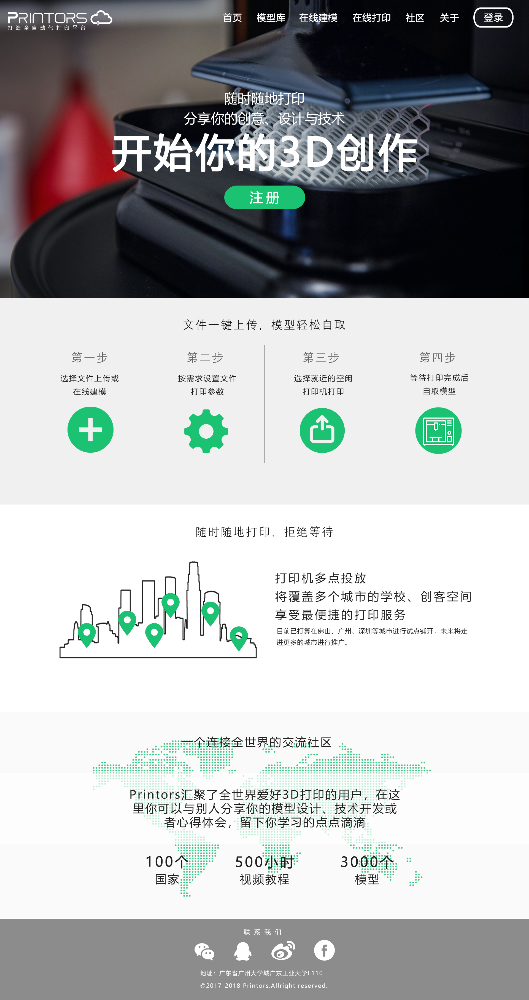

## 3d打印云平台
   3D打印云平台是全自动3D打印机集成系统中的重要一环，负责为用户提供3D模型上传预览、在线建模、在线打印等功能；目的是为3D打印爱好者或其他应用者，提供便捷的服务。

## 主要技术栈
    * [RequireJs](http://www.requirejs.cn/docs/start.html#get)
    * [jQuery](https://www.jquery123.com/)
    * [ThreeJs](https://threejs.org/)
   
## 项目效果图
    
    
